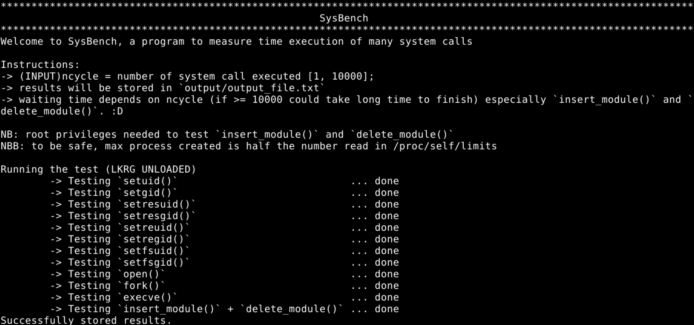

# SysBench

A simple C Command Line Interface program to measure time execution of many system calls.

The choice is moved by the need to tests the Linux Kernel Runtime Guardian performance, an important and innovative Linux kernel module with the aim of defending your system from different attacks.
Since LKRG enforce integrity check when some specific system call is called (as described in the [OpenWall lkrg page](http://www.openwall.com/lkrg/)), these tests test time execution of that specific functions to measure the delay caused by it.

## Getting Started

### Prerequisites

In order to be executed, it is required:

* gcc updated ``apt install gcc``
* make command install ``apt install make``
* libelf-dev to create ELF image ``apt install libelf-dev``
* linux-headers to compile the test module ``apt install linux-headers-$(uname -r)``

There is an easier way to get both gcc, make and other tool, thanks to your system is ready to build every file in the project ``apt install build-essential``.

### Installing

The installation of this software is quite simple. All you have to do is going in the project's folder and type ``make``. The Makefile take care of compiling both the test module for the kernel and the user application.

## Running the tests

Once the project is successfully compiled, it can be run in many different ways:

* single mode -> ``[sudo] ./sysbench ncycle filename``
* multiple mode -> ``sudo ./script.sh ntimes ncycle path/to/p_lkrg.ko``

In single mode, the difference between running the program with privileges and not, consists in the last test where the module is loaded and unloaded in the kernel. This mode is the classic way to run a program, and it requires two parameters: the first one is the number of times that every system call is called, while the second is the file name where you want to store the result.

While the single mode can be run in every situation, multiple mode is used to benchmark your system with LKRG on and off, as the script takes care of loading/unloading LKRG every time SysBench is called. In fact, ntimes represents the number of times SysBench is run, ncycle has already been explained and the last parameter is the path to the LKRG compiled .ko image.

The following image is an example of a single mode execution

### Break down into end to end tests

System calls analysed are the following:

* write() 
* read()
* open()
* fork()
* execve()
* setuid()
* setgid()
* setresuid()
* setresgid()
* setreuid()
* setregid()
* setfsuid()
* setfsgid()
* insert_module()
* delete_module()

Whereas many functions can be easily run, some of those requires more attention, because they are potentially dangerous. Thus, functions like setuid(), setgid(), etc., set values to the actual values retrieved by their opposites (ex. getuid()). LKRG does integrity check whenever one of these is called, independently by the parameter.

## Author

**Simone Magnani** * *Bachelor degree thesis* * [Linkedin](https://www.linkedin.com/in/simone-magnani-564830151/)

## License

This project is licensed under the University of Bologna license.

## Acknowledgments

Special thank goes to my supervisor prof. Gabriele D'Angelo who challenged me to do this thesis project. He has always been available, reliable and his suggestions helped me to go further all the difficulties.
